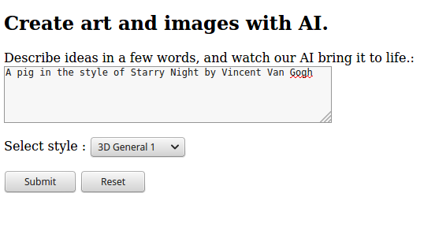
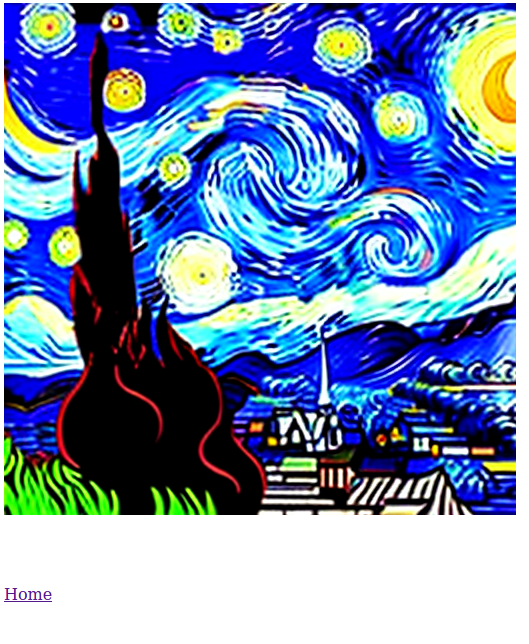

# PIIS_ZPI-zp01_Smilianskyi

### Веб застосунок для генерації зображення нейромережею Hotpot за допомогою текстового опису.

Додаток написано на Java за допомогою Servlet API. Він взаємодіє по REST протоколу з API інструменту Art Generator нейромережі. Є можливість вибору стилю в якому мережа згенерує зображеня.

## Для запуску треба зібрати WAR артефакт та задеплоїти його в контейнер сервлетів по типу Tomcat.

**Скріншоти веб інтерейфйсу та демонстрації роботи:**

**Запит:**

**Результат:**

